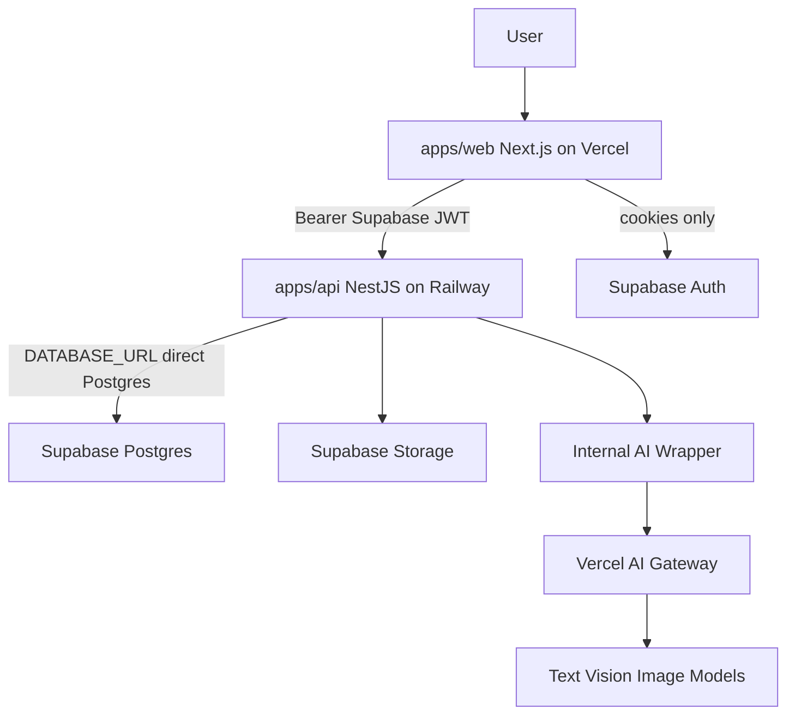
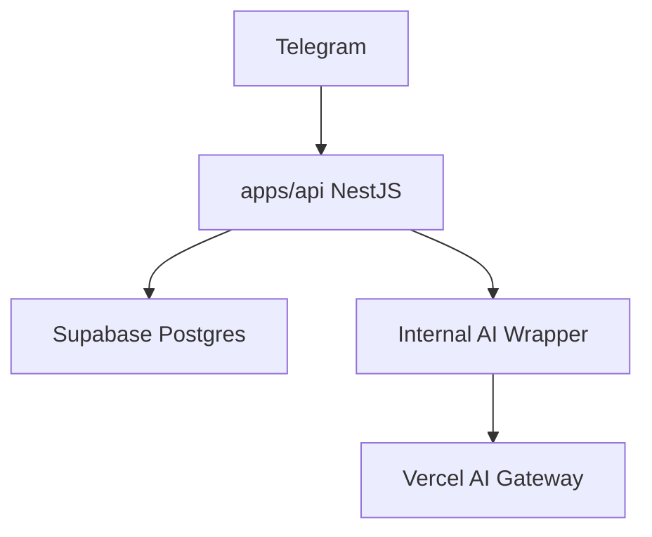

# Fridge2Recipe Architecture

## Monorepo Shape

Fridge2Recipe is a pnpm monorepo with two applications and shared infrastructure:

- `apps/web` — Next.js UI on Vercel (auth sessions only; no direct Postgres access)
- `apps/api` — NestJS REST API on Railway (all product behavior, AI, and database access)
- `supabase/` — Supabase CLI config for local Auth, Storage, and Postgres; schema is owned by Prisma in `apps/api`

## Boundaries

- UI code stays in `apps/web` routes and components.
- Supabase Auth session management stays in `apps/web` (browser and server clients, middleware).
- All product behavior lives in `apps/api` NestJS modules — not in Next.js pages, route handlers, or `apps/web/src/services`.
- `apps/web` calls `apps/api` over REST via `apps/web/src/lib/api/client.ts`, forwarding the Supabase access token.
- `apps/api` validates JWTs with `SUPABASE_JWT_SECRET` and derives `userId` from the token `sub` claim. Never accept `user_id` from request bodies.
- `apps/api` connects to Postgres with Prisma via `DATABASE_URL` (direct connection). Filter every query by `userId` from the JWT in application code.
- `apps/api` uses `@supabase/supabase-js` for Supabase Storage (and Realtime if added later), not for Postgres queries.
- Generated Prisma Client lives in `apps/api/generated/prisma`. `apps/api/src/supabase/database.types.ts` remains for Supabase client typings only.
- AI calls go through `apps/api/src/ai/` rather than calling provider APIs from feature code.

## AI Features

The MVP should support:

- Fridge-photo understanding to identify likely inventory items.
- Recipe suggestions from inventory and preferences.
- Meal-planning assistance.
- Generated recipe images, protected by strict cost limits.

Save useful generated outputs so repeated views do not call AI again.

## Future Chat Agent

Chat integrations such as Telegram will call `apps/api` directly when built. Account linking and bot authentication are deferred — see ADR 0002.

Do not add chat webhook routes to `apps/web`. The NestJS backend is the single product API for all clients.
