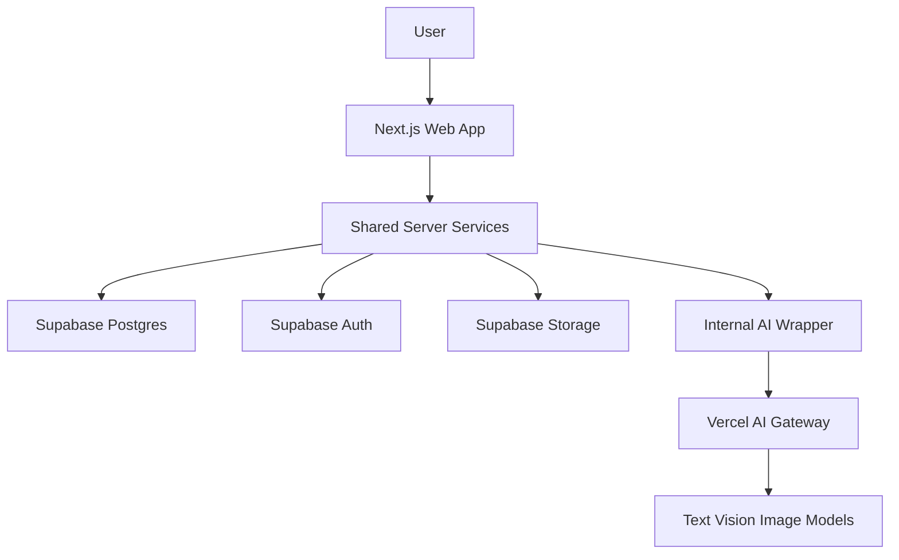
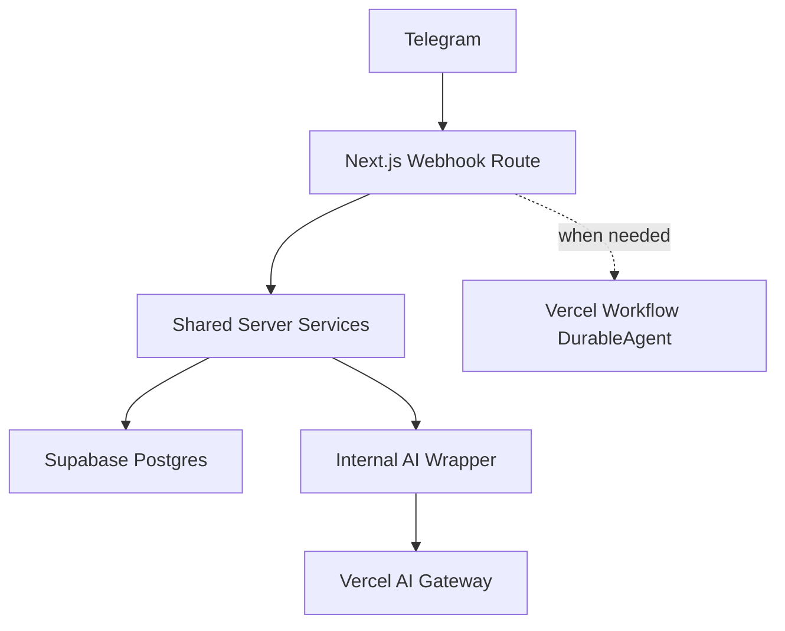

# Fridge2Recipe Architecture

## MVP Shape

Fridge2Recipe starts as a single full-stack Next.js application deployed on Vercel. Supabase provides the managed backend capabilities: Postgres database, authentication, storage, and row-level security.

## Boundaries

- UI code should stay in the Next.js app routes and components.
- Product behavior should live in shared server-side services, not directly inside pages or route handlers.
- Supabase access should be typed with generated database types.
- AI calls should go through an internal wrapper rather than calling provider APIs throughout the codebase.

## AI Features

The MVP should support:

- Fridge-photo understanding to identify likely inventory items.
- Recipe suggestions from inventory and preferences.
- Meal-planning assistance.
- Generated recipe images, protected by strict cost limits.

Save useful generated outputs so repeated views do not call AI again.

## Future Chat Agent

Chat integrations such as Telegram should be added through Next.js route handlers.

Do not introduce a separate agent backend until the route-handler approach becomes insufficient. Add durable workflow support only for multi-step, retryable, long-running, or externally resumed work.
